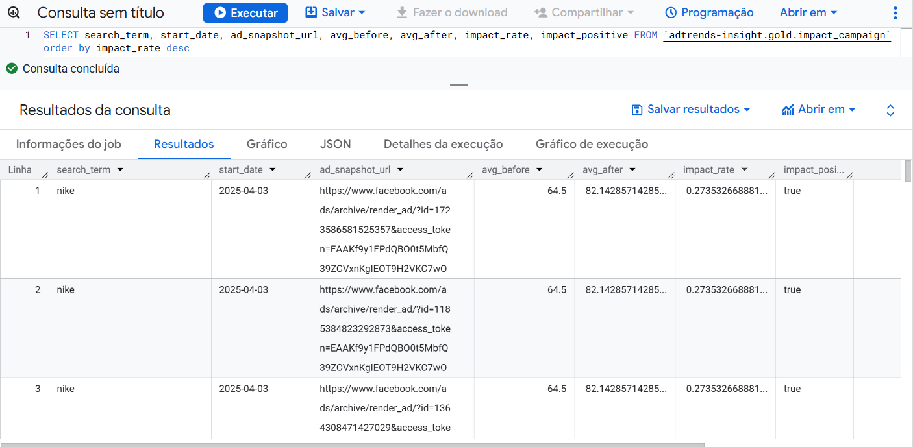

# Projeto AdTrends Insight
"Será que uma campanha publicitária aumenta o interesse real das pessoas pela marca?". Para responder isso, o projeto propõe cruzar dados de campanhas públicas da Meta com tendências de busca do Google, e criar uma métrica de impacto.

O inicial foi na marca Nike, mas a estrutura em é reutilizável e escalável para qualquer marca ou setor.

## Stack Utilizada
Google Cloud Platform (GCP)

Cloud Functions (Python)

Cloud Storage

BigQuery

Terraform (Infraestrutura como código)

Dataform (Modelagem de dados e criação da camada Gold)

Python (extração de dados via APIs públicas)

## O Que Foi Construído
## Pipelines de Coleta
Cloud Function 1: coleta anúncios da Facebook Ads Library, filtrando por termos relacionados à marca.

Cloud Function 2: coleta dados do Google Trends com os mesmos termos.

Os dados são armazenados no Cloud Storage como JSONs e ingeridos no BigQuery via tabelas externas.

## Camadas de Modelagem no Dataform
## Bronze:
Dados brutos (JSONs).

## Silver:
Limpeza e padronização.

## Gold: 
Criação de métricas comparativas, como:

Média de interesse orgânico antes e depois do início de uma campanha.

Cálculo do impact rate.

Indicador binário de impacto positivo.

## Por que foi necessário usar APIs públicas e não ADS, GA4... 

A API oficial do Facebook Ads requer acesso restrito, com permissões específicas para contas de anunciantes. Sem essa permissão, optei por explorar a Facebook Ads Library, que oferece dados públicos de anúncios ativos, embora com algumas limitações de granularidade e autenticidade das campanhas.

Apesar disso, consegui construir um pipeline funcional e confiável, utilizando somente dados públicos.

## Desafios Superados
Configuração da conta gratuita no GCP, com controle de billing e permissões.
Setup do Terraform: criação e gerenciamento das funções em Cloud Functions com infraestrutura como código.
Integração com o Dataform: estruturação de schemas, configuração de repositórios Git, segredos e permissões.
Criação de funções Python desacopladas e reutilizáveis, preparadas para escalabilidade.
Ajuste de autenticação e políticas do Service Account para acessar segredos e recursos.

## Aprendizados Técnicos
Estruturar um projeto de ponta a ponta no GCP.
Aprofundei conhecimentos em Terraform, DatafoAm e deploy automatizado com Git.
Refinei minha habilidade de resolver problemas de permissão, autenticação e dependência entre recursos.
Desenvolvi raciocínio analítico para tirar insights de comportamento a partir de dados públicos.

##  Próximos Passos
Criar uma visualização interativa dos dados com Looker Studio ou Streamlit.
Estender a análise para outros termos de busca e segmentos, como saúde, alimentação, imóveis ou política.

##  Imagem que rankeia as campanhas que mais tiveram impacto real nas buscas pelo termo no Google.

